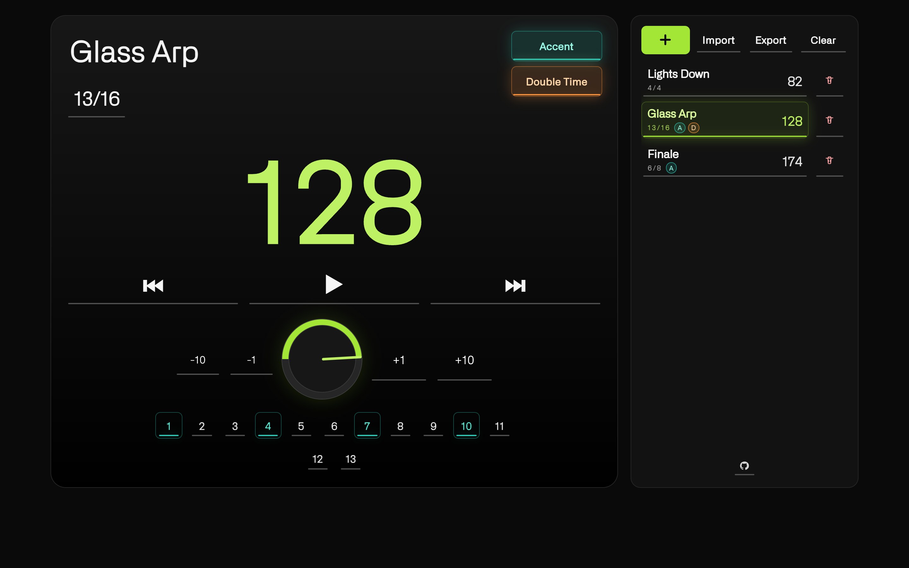

# etro

`etro` is a static, touch-first metronome built for live performance.

It keeps the main controls large, the setlist close at hand, and the timing stable with a Web Audio scheduler instead of `setInterval`.

## What it looks like



## Highlights

- Web Audio `currentTime` scheduler for steadier timing
- Setlist workflow with add, select, delete, and reset
- BPM range `20-240`
- Time signatures: `4/4`, `6/8`, `3/4`, and custom
- Custom signatures support top values `1-32` and bottom values `2`, `4`, `8`, or `16` such as `13/16`
- Accent toggle with editable accent-map beats
- Double Time subdivision toggle per song that preserves the base tempo
- Export/share links and import flow with destructive-action confirmation
- Persistent local data via `localStorage`
- Installable PWA with offline support and Wake Lock when available

## Project stance

- `etro` is a non-commercial project.
- `etro` is open source.
- Contributions are welcome.

## PWA support

`etro` is configured as a Progressive Web App (PWA):

- Installable on supported mobile and desktop browsers
- Offline-capable after first load with a cache-first local app shell and background refresh checks
- Standalone app mode with theme color and app icons

### PWA files

- `manifest.json` - web app manifest
- `sw.js` - service worker cache/offline logic
- `assets/icons/` - app icons (`192`, `512`, `maskable`, Apple touch icon, favicon)

### Install on device

- Android (Chrome/Edge): open the site, then use **Install app** / **Add to Home screen**
- iOS (Safari): open the site, tap **Share** -> **Add to Home Screen**
- Desktop Chromium browsers: use the install icon in the address bar

Note: service workers require HTTPS (or `localhost`). Vercel provides HTTPS by default.

## Share and import

1. Tap `Export` in the setlist panel to generate a link.
2. Use `Copy Link` or native `Send`.
3. On another device, open `Import`, paste the link or code, review the replacement, then tap `Replace Setlist`.

Notes:

- Import replaces the current setlist only after a confirmation step.
- Opening a URL with `#sl=...` pre-fills the import modal automatically.

## Default state

On first load and after reset:

- 1 song
- Empty title (shown as `Untitled` in the main view)
- BPM `120`
- Time signature `4/4`
- Accent off
- Double Time off

The setlist never stays empty.

## Project structure

- `index.html` - app markup and share metadata
- `assets/css/styles.css` - source stylesheet for the local app-shell build
- `assets/css/app-shell.css` - generated CSS shipped by the app
- `assets/fonts/` - self-hosted font files and licenses
- `assets/js/app.js` - app logic and audio scheduler
- `manifest.json` - PWA manifest
- `sw.js` - PWA service worker

## Local run

Install dependencies once, then build the local CSS bundle:

```bash
npm install
npm run build:css
```

Serve the app:

```bash
python3 -m http.server 8080
```

Open `http://localhost:8080`.

When you change `index.html`, `assets/js/app.js`, or `assets/css/styles.css`, run `npm run build:css` again before testing or committing.

## Font note

`etro` now self-hosts Alliance No.1 locally as the primary UI font. The app no longer depends on any remote font CDN at runtime.

If you want to try another licensed font later, start in [assets/fonts/README.md](/Users/awidodo/repo/etro/assets/fonts/README.md).

## Contributing

1. Fork the repo: `https://github.com/widodoalfianto/etro`
2. Create a branch.
3. Open a pull request with a clear summary.

Bug reports and feature requests are also welcome in Issues.

## Browser notes

- Audio starts after user interaction because of browser autoplay policy
- Wake Lock support depends on browser and device
